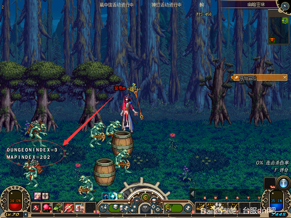

# squirrel脚本在游戏中简单显示调试信息

`common/chareffect/1.ani`
```
#PVF_File
[LOOP]
1
[SHADOW]
0
[FRAME MAX]
48
[FRAME000]
[IMAGE]
`Interface2/Keyoption/Keyoption.img`
61
[IMAGE POS]
00
[DELAY]
1000


[FRAME001]
[IMAGE]
`Interface2/Keyoption/Keyoption.img`
52
[IMAGE POS]
00
[DELAY]
1000


[FRAME002]
[IMAGE]
`Interface2/Keyoption/Keyoption.img`
106
[IMAGE POS]
00
[DELAY]
1000


[FRAME003]
[IMAGE]
`Interface2/Keyoption/Keyoption.img`
79
[IMAGE POS]
00
[DELAY]
1000


[FRAME004]
[IMAGE]
`Interface2/Keyoption/Keyoption.img`
55
[IMAGE POS]
00
[DELAY]
1000


[FRAME005]
[IMAGE]
`Interface2/Keyoption/Keyoption.img`
56
[IMAGE POS]
00
[DELAY]
1000


[FRAME006]
[IMAGE]
`Interface2/Keyoption/Keyoption.img`
53
[IMAGE POS]
00
[DELAY]
1000


[FRAME007]
[IMAGE]
`Interface2/Keyoption/Keyoption.img`
54
[IMAGE POS]
00
[DELAY]
1000


[FRAME008]
[IMAGE]
`Interface2/Keyoption/Keyoption.img`
94
[IMAGE POS]
00
[DELAY]
1000


[FRAME009]
[IMAGE]
`Interface2/Keyoption/Keyoption.img`
78
[IMAGE POS]
00
[DELAY]
1000


[FRAME010]
[IMAGE]
`Interface2/Keyoption/Keyoption.img`
92
[IMAGE POS]
00
[DELAY]
1000


[FRAME011]
[IMAGE]
`Interface2/Keyoption/Keyoption.img`
93
[IMAGE POS]
00
[DELAY]
1000


[FRAME012]
[IMAGE]
`Interface2/Keyoption/Keyoption.img`
97
[IMAGE POS]
00
[DELAY]
1000


[FRAME013]
[IMAGE]
`Interface2/Keyoption/Keyoption.img`
62
[IMAGE POS]
00
[DELAY]
1000


[FRAME014]
[IMAGE]
`Interface2/Keyoption/Keyoption.img`
69
[IMAGE POS]
00
[DELAY]
1000


[FRAME015]
[IMAGE]
`Interface2/Keyoption/Keyoption.img`
87
[IMAGE POS]
00
[DELAY]
1000


[FRAME016]
[IMAGE]
`Interface2/Keyoption/Keyoption.img`
59
[IMAGE POS]
00
[DELAY]
1000


[FRAME017]
[IMAGE]
`Interface2/Keyoption/Keyoption.img`
60
[IMAGE POS]
00
[DELAY]
1000


[FRAME018]
[IMAGE]
`Interface2/Keyoption/Keyoption.img`
57
[IMAGE POS]
00
[DELAY]
1000


[FRAME019]
[IMAGE]
`Interface2/Keyoption/Keyoption.img`
58
[IMAGE POS]
00
[DELAY]
1000


[FRAME020]
[IMAGE]
`Interface2/Keyoption/Keyoption.img`
63
[IMAGE POS]
00
[DELAY]
1000


[FRAME021]
[IMAGE]
`Interface2/Keyoption/Keyoption.img`
101
[IMAGE POS]
00
[DELAY]
1000


[FRAME022]
[IMAGE]
`Interface2/Keyoption/Keyoption.img`
98
[IMAGE POS]
00
[DELAY]
1000


[FRAME023]
[IMAGE]
`Interface2/Keyoption/Keyoption.img`
110
[IMAGE POS]
00
[DELAY]
1000


[FRAME024]
[IMAGE]
`Interface2/Keyoption/Keyoption.img`
109
[IMAGE POS]
00
[DELAY]
1000


[FRAME025]
[IMAGE]
`Interface2/Keyoption/Keyoption.img`
108
[IMAGE POS]
00
[DELAY]
1000


[FRAME026]
[IMAGE]
`Interface2/Keyoption/Keyoption.img`
107
[IMAGE POS]
00
[DELAY]
1000


[FRAME027]
[IMAGE]
`Interface2/Keyoption/Keyoption.img`
75
[IMAGE POS]
00
[DELAY]
1000


[FRAME028]
[IMAGE]
`Interface2/Keyoption/Keyoption.img`
104
[IMAGE POS]
00
[DELAY]
1000


[FRAME029]
[IMAGE]
`Interface2/Keyoption/Keyoption.img`
74
[IMAGE POS]
00
[DELAY]
1000


[FRAME030]
[IMAGE]
`Interface2/Keyoption/Keyoption.img`
102
[IMAGE POS]
00
[DELAY]
1000


[FRAME031]
[IMAGE]
`Interface2/Keyoption/Keyoption.img`
96
[IMAGE POS]
00
[DELAY]
1000


[FRAME032]
[IMAGE]
`Interface2/Keyoption/Keyoption.img`
51
[IMAGE POS]
00
[DELAY]
1000


[FRAME033]
[IMAGE]
`Interface2/Keyoption/Keyoption.img`
89
[IMAGE POS]
00
[DELAY]
1000


[FRAME034]
[IMAGE]
`Interface2/Keyoption/Keyoption.img`
95
[IMAGE POS]
00
[DELAY]
1000


[FRAME035]
[IMAGE]
`Interface2/Keyoption/Keyoption.img`
90
[IMAGE POS]
00
[DELAY]
1000


[FRAME036]
[IMAGE]
`Interface2/Keyoption/Keyoption.img`
91
[IMAGE POS]
00
[DELAY]
1000


[FRAME037]
[IMAGE]
`Interface2/Keyoption/Keyoption.img`
73
[IMAGE POS]
00
[DELAY]
1000


[FRAME038]
[IMAGE]
`Interface2/Keyoption/Keyoption.img`
105
[IMAGE POS]
00
[DELAY]
1000


[FRAME039]
[IMAGE]
`Interface2/Keyoption/Keyoption.img`
103
[IMAGE POS]
00
[DELAY]
1000


[FRAME040]
[IMAGE]
`Interface2/Keyoption/Keyoption.img`
71
[IMAGE POS]
00
[DELAY]
1000


[FRAME041]
[IMAGE]
`Interface2/Keyoption/Keyoption.img`
80
[IMAGE POS]
00
[DELAY]
1000


[FRAME042]
[IMAGE]
`Interface2/Keyoption/Keyoption.img`
77
[IMAGE POS]
00
[DELAY]
1000


[FRAME043]
[IMAGE]
`Interface2/Keyoption/Keyoption.img`
76
[IMAGE POS]
00
[DELAY]
1000


[FRAME044]
[IMAGE]
`Interface2/Keyoption/Keyoption.img`
83
[IMAGE POS]
00
[DELAY]
1000


[FRAME045]
[IMAGE]
`Interface2/Keyoption/Keyoption.img`
82
[IMAGE POS]
00
[DELAY]
1000


[FRAME046]
[IMAGE]
`Interface2/Keyoption/Keyoption.img`
72
[IMAGE POS]
00
[DELAY]
1000


[FRAME047]
[IMAGE]
`Interface2/Keyoption/Keyoption.img`
81
[IMAGE POS]
00
[DELAY]
1000
```

```javascript
function drawText(obj, str,x ,y ) {
    if (!obj) return;
    local fontSize = 26;
    local charSpacing = -16;
    local aniPath = "Common/chareffect/1.ani";
    local sq_var = obj.getVar();
    local info = {["0"]=0,["1"]=1,["n"]=2,["o"]=3,["4"]=4,["5"]=5,["2"]=6,["3"]=7,["h"]=8,["i"]=9,["f"]=10,["g"]=11,["l"]=12,["-"]=13,["*"]=14,["+"]=15,["8"]=16,["9"]=17,["6"]=18,["7"]=19,["="]=20,["z"]=21,[";"]=22,["/"]=23,["."]=24,["'"]=25,["m"]=26,["t"]=27,["v"]=28,["r"]=29,["x"]=30,["k"]=31,["`"]=32,["a"]=33,["j"]=34,["s"]=35,["d"]=36,["e"]=37,["b"]=38,["c"]=39,["q"]=40,["p"]=41,["u"]=42,["y"]=43,["\\"]=44,["]"]=45,["w"]=46,["["]=47,}
    
    for (local i=0; i<str.len(); i+=1) {
        local val = info[str.slice(i,i+1)];
        local sprChar = sq_var.GetAnimationMap("sprChar", aniPath);
        sq_SetAnimationFrameIndex( sprChar, val);
        sq_drawCurrentFrame(sprChar, x + i * (fontSize + charSpacing), y, false);
    }
}
```

本来想要看一些游戏内的数据，在贴吧搜索print打印相关结果不尽人意。但看到这个 [帖子](https://tieba.baidu.com/p/7222656420) 觉得不错，但是时间紧迫就自己实现了。在drawCustomUI或者drawMainCustomUI中使用可以在屏幕上显示文本，仅仅支持26个英文字符和10个数字已经少部分符号，其中str文本参数只能用小写英文。因为文字用的是游戏自带的图片所以不需要额外的npk但是需要保证Interface2/Keyoption/Keyoption.img存在。

使用效果如下: 



> [原贴](https://tieba.baidu.com/p/7239514045?pid=138075656154&cid=0#138075656154)
