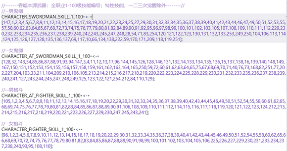
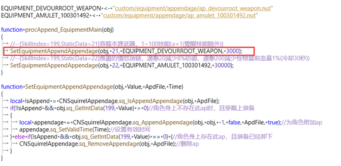
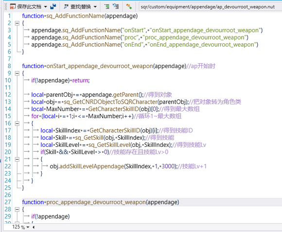
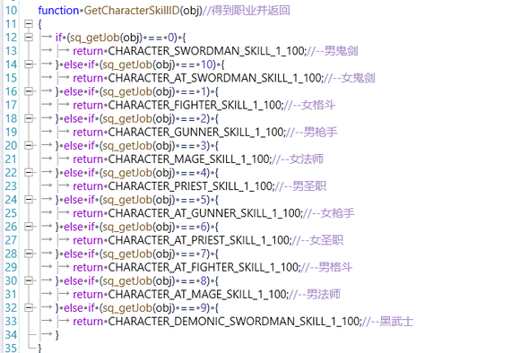
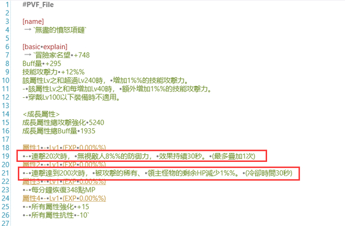
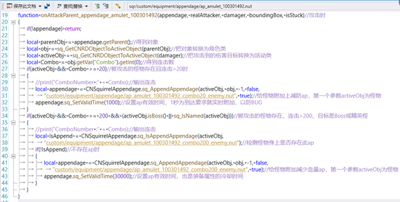
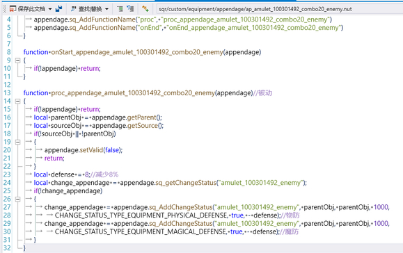
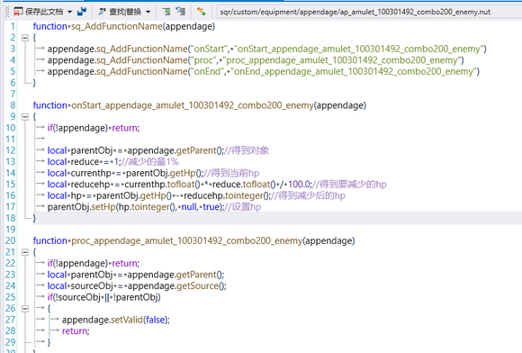

# 如何用Nut来写一些台服不方便实现的装备属性

由于台服端局限太大，所以很多装备的属性无法实现；从而让人很遗憾。
而nut呢却在这时给了人很大的希望，运用得当的话可玩性还是特别高的。
原理呢，为了方便起见，就是运用技能静态做为跳板来触发nut，当然方法还有别的。
对于精通nut的吧友来说，这些都只是班门弄斧。

列子1：
我这以105装备属性为例
由于台服的局限

```ini
[all skill item]
[item growtype]
`[swordman]`0
[skill apply condition]
[skill group]
`[all]`
[lower bound level]
1
[upper bound level]
70 //最高只能70
[value]
1
[extra condition]
`[except for ex skill]`
[/extra condition]
[/skill apply condition]
[skill phase]
`[all]`
[/all skill item]
```
70级以上的技能增加等级可以使用apd，也可使用nut(我就说下nut了)


首先，先编历出pvf内的技能编号：列出所有技能编号，并排除觉醒和特性技能
（第一个数据为数组量，后面会用到）



装备写入增加静态数据，我使用的199，静态编号21


为了确保在副本内实现刷新，我使用procAppend函数来检测并为角色附加
当检测到技能199的21静态数据>0时，为角色附加ap
红框内容参数：1:对象，2:静态，3:ap路经，4:ap有效时间（写法个人习惯）



ap开始时得到技能并增加等级




得到当前职业，并返回当前职业内容



接下来测试

上排前三个技能：42 21 39 37（未穿上装备时）


上排前三个技能：43 22 40 38（穿上装备时）


列子2：



前面给角色附加ap照列子1就行，就不写了直接进入主题



减防ap



减少当前1%血量ap（只在ap开始时减少一次，而ap有效时间30秒，也就等于装备属性的冷却）


