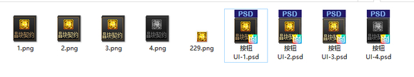
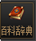
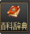
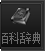

# 添加按钮呼出窗口

最近一直研究如何呼出窗口来实现一些便利性操作
便想到了 晶之契约，往往要重复几步来打开就非常麻烦
现在通过在物品栏增加一个按钮，点击按钮来实现呼出晶之契约
制作UI按钮需要一定的PS经验，今天分享下成果，教程需自己领悟（我只是个小白..）







按钮组图，自己拿，如何发挥自己PS操作即可。
按钮NPK路劲：sprite/interface/newstyle/windows/inventory/inventory_tw.img
按钮这个可以在UI里面这定义路径吧，也不用非要这个路径。
1.
我们通过找到物品栏背包UI窗口：ui/inventory/iteminventorywindow.ui
找到这一条，然后打开UI/Inventory/inventory_item.ui
（记住，UI按钮在物品栏UI内的话，他只会在物品栏位置显示，其余栏位自行操作）
找个空白地方添加以下按钮
```ini
[ui controls]
    `[text button]`
    `2002`  2482142 //按钮位置
    `Interface/newstyle/windows/Inventory/inventory_tw.img` //这个为你按钮的路劲
    ``  419202119 //这个为你按钮的路劲按钮编号，看好按钮组图的排列
[/ui controls]
```
2.
按钮制作完成后，可以通过按钮来增加一个提示
```ini
[ui controls]
    `[tooltips]`
    `2002`  1962132 //按钮提示位置（居中在按钮上方，移动按钮记得这个也要同等移动）
    `2002`
    `点击可打开晶块契约
    也可点击关闭字体仓库`41240-11
[/ui controls]
```
3.
sqr/ui/skinstorage/skinstorage_function.nut
（skinstorage_function.nut 认准这个窗口绘制nut）
已知晶块契约窗口编号为：252 （其余窗口自行摸索）
在这个NUT文件内搜索：function onMouseLeftButtonDown_AllGrowJob(obj)
然后添加以下函数
{
local ui = sq_GetPopupWindowMainCotrol(64);//在该编号窗口内打开
if(isInXYArea(ui.GetXPos()+248,ui.GetYPos()+220,45,45))//呼出窗口的坐标
{
if(INVENTORY_DOWN == 0)
{
sq_OpenPopupWindow(252, 0, 0, 0);//呼出窗口的编号 252为晶块契约
}else
INVENTORY_DOWN = 0;
}
}
小白的一些讲解：
64为物品栏背包的窗口编号
248为X轴坐标，220为Y轴坐标， 45*45为该坐标的正方形大小，请自行适配UI按钮位置
252为晶块契约的窗口，这个位置可自由发挥，找到好玩的窗口编号都可以呼出
PS： 个别窗口会导致闪退，忘记是哪些了，有的需要通过开启活动才可以呼出
75为装备词典的编号（感谢 真滴狗2 大佬的提供，爱你）
4.
找到晶块契约的UI文件：ui/cubecontract/cubecontractwindow.ui
[horizontal distance]
295
[vertical distance]
240
水平垂直居中，该数值为800*600，宽屏玩家自行适配即可。
该教程也算是比较详细了，主要要注意的就是nut需要合并好和按钮贴图需要自己制作，其余其实没什么难度，这个窗口呼出对大佬来说也是喝完水的，哈哈哈，感谢，有什么疏漏也可以和我说哈哈，我再优化下