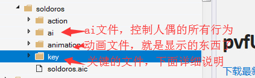
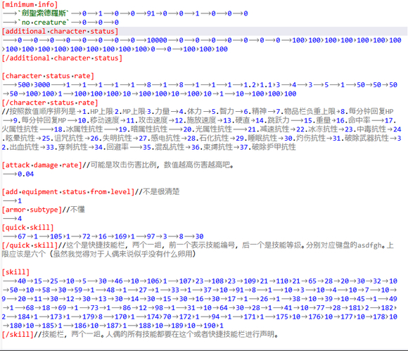
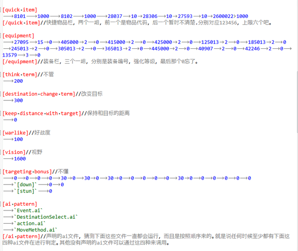
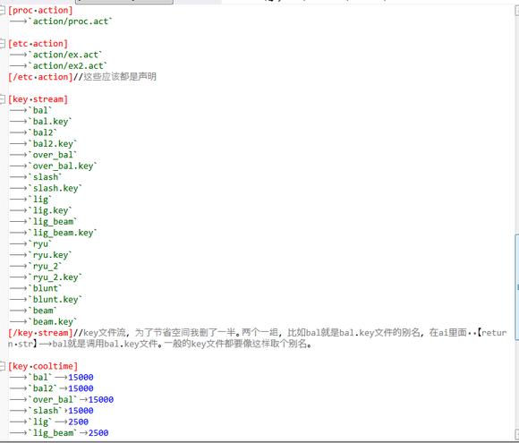
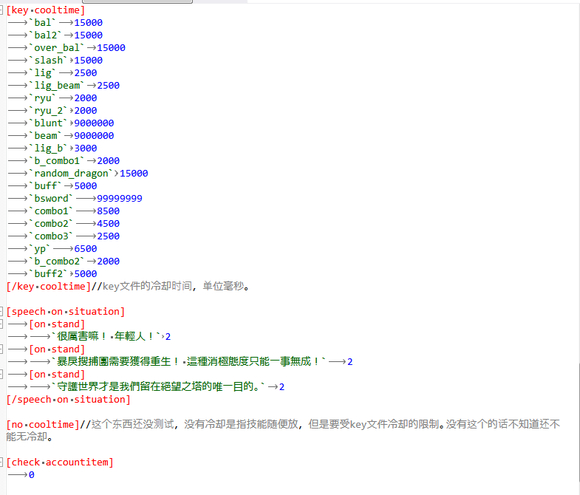
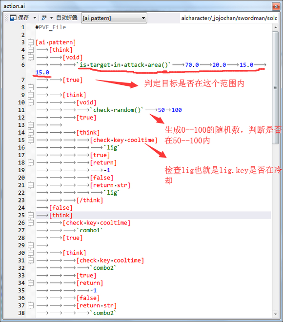

# APC人偶修改详细教程

前言：本教程是我看豆腐百科里面翻译的韩文文档，然后靠着自己的一些C语言基础，再加上一些大佬的解答，从而得出的一些经验。希望能帮到一些想要修改apc的人。（本人技术有限，如有错误欢迎指出。）我暂时就研究了一下剑圣·索德罗斯，所以就拿它为例：
一般apc都包含这几个文件：

其中action应该是用来调用animation显示各种贴图的。soldoros.aic是人偶主文件，其他文件都要在这里声明。先来讲.aic文件：







## 按键设置
- 用法示例：
[key stream] //密钥名称（可选），密钥文件名
`combo`` combo attack.key` //键名：`combo`，索引：0
`AICharacter / cuwaki / key / a.key` //键名：`a`，索引：1
```AICharacter / cuwaki / key / s.key` //键名：`s`，索引：2
[/ key stream]

- 在[key stream]中列出密钥名称和密钥文件名称
- 键名是可选的，不得以“.key”结尾。当它以“.key”结尾时，它被识别为密钥文件名
- 省略键的名称，或您输入的``删除路径和文件名扩展的关键，并自动分配到的键名
- 键名称按顺序从0开始分配
- 在ai文件的[return]处使用键名和分配的索引
- 密钥文件名是相对路径减去脚本路径或没有路径的输入文件名。
如果未输入路径，则该文件位于包含aic文件的目录中的子目录“key”下。


* APC的派对指定功能
1.将固定的成员分配给aic文件
- 固定成员的成员索引从1开始使用
- 未更改指定的固定成员
- 固定成员的数量几乎没有限制。
指定方法）
[party member] //会员索引，APC索引
1 20402 // 1号是反铲
2 5004 //第2号是阿拉德战役
3 605 //第3号骨扫描
[/party member]


2.自动注册：自动注册，无需指定
- 0号指向自己。
- 按-1，-2，-3的顺序注册
- 如果成员消失（死亡），则重新分配索引以填充空号码
- 自动登记的成员人数几乎没有限制。


3.如何使用注册的成员
- 在ai文件中使用prist party buff功能之前指定party成员
- [set party member] {member index}：指定buff技能的成员


4.相关附加组件：用于ai文件
- [party member alive]：检查指定的成员是否处于活动状态。
- [party member hp] {comparison} {value}：检查指定成员的hp


5.用法示例：ai文件
[think] [设置成员] 2 //在2中指定注册的成员
[think] [party member alive]
[true]
[think] [party member hp]`％>`50
[true] [return]`a` //使用分配给第2方的第2方的FastHill技能。
[false] [return] -1
[/think]
[false]
[return] -1
[/think]
[/think]


* APC的被动对象创建禁止功能。
1.将被动对象索引分配给aic文件。
如何指定
[limit passiveobject]
1 //索引
1 //索引
....
[/ limit passiveobject]


2.使用此命令让apc在执行某些操作时创建另一个对象而不是指定的对象。


## 标记功能

```
[check accountitem] 0 //是否系统检查该帐户是否归因1.复选框（缺省值），检查无0.3）中，当不能使用的用品的超过70代表APC系统gwitem检查
```


接下来是ai文件



这个理解函数和关键字的语法就行了。
1. * .ai这是什么？
ai是一个脚本，用于对角色进行编程以确定要执行的操作。
它的编程类似于c语言编程。 （当然，更不方便但是-_-）
2. * .ai
ai的类型
.ai文件按目的划分。让我简要介绍一下你。
2.1。 Action.ai
它用于攻击，buff等。
返回值是.aic（AI C字符）文件。
它与[key stream]中指定的键输入文件1：1匹配，用于执行它。
2.2。 DestinationSelect.ai
这用于确定选择要移动到的目标的模式。
其返回值是表示预编码的目标决策模式的数字。
（有关确定较低目的地的方法，请参阅数值表）
- 有关更多信息，请参阅`destination select.rtf`。
2.3。 Event.ai
它用于确定事件发生时要采取的操作。
返回值是.aic（AI C字符）文件。
它与[key stream]中指定的键输入文件1：1匹配，用于执行它。
2.4。 MoveMethod.ai
它用于选择移动到目的地时的移动方式。
返回值决定是跳转，转到破折号还是走路。
（根据底部运动方法参考数值表）


3.引入条件变量
`输入条件变量时是可选的


3.1。 `[void]`=没有输入
3.2。 `[mind]`=
3.3。 `[hp]`=当前的健康状况
3.4。 `[mp]`=当前的马力
3.5。 `[好战]`=侵略
3.6。 `[目标距离]`=与当前目标的像素距离
3.7。 `[random]`=从0到99的随机值（续！）
3.8。 `[last result]`=上一次操作的结果（某些特定函数在这里放置值）
3.9。 `[武器类型]`=表示武器的类型。
近战=刺客，服装，牧师，战斗图像= 0
范围=格雷罗，巫师= 1 </ FONT>


3.10。 `[target state]`=当前目标的状态（站立，坐下，伤害，跳跃等）
每个州都有一个固定的数字（参见下面每个州的数字表）


3.11。 `[state]`=当前状态（站立，坐下，伤害，跳跃等）
每个州都有一个固定的数字（参见下面每个州的数字表）


3.12。 `[event]`=事件类型（伤害，攻击等）
每个州都有一个固定的号码（请参阅下面每个事件的数字表）


3.13。 `[attack success]`=攻击成功（攻击 - 事件.ai）
怎么用）[思考] [攻击成功] 1


3.14。 `[hit]`=是否被击中（当你受伤时 - Event.ai）
怎么用）[思考] [点击] 1


3.15。 `[element]`=命中或命中Daisy的属性（攻击或破坏时 - Event.ai）
如何使用）[think] [element]`attribute`


3.16。 `[cast]`=是否使用施法技能（技能.- Event.ai）
怎么用）[思考] [铸造] 1


3.17。 `[distance]`=检查与对手的距离（攻击或破坏时 - Event.ai）
怎么用）[思考] [距离]`距离'


3.18。 `[my active status]`=检查我的状态变化（Continuously - Action.ai）
怎么用）[思考] [我的活跃状态]


3.19。 `[my state]`=检查我的状态（不断 - Action.ai）
如何使用）[思考] [我的州]`州`


3.20。 `[target state]`=检查对手的状态（攻击或破坏时 - Event.ai，持续 - Action.ai）
如何使用）[思考] [目标国家]`州`


3.21。 `[my active status on]`=检查我的状态变化（仅在状态变化时 - Event.ai）
怎么用）[思考] [我的活跃状态]


3.22。 `[target active status]`=检查对方的状态（攻击或破坏时 - Event.ai）
怎么用）[思考] [目标活跃状态]


3.23。 `[attack type]`=检查我的攻击类型（攻击或破坏时 - Event.ai）
如何使用）[思考] [攻击类型]`类型`


3.24。 `[目标类型]`=检查对手的攻击类型（攻击或破坏时 - Event.ai）
如何使用）[思考] [目标类型]`类型`


3.25。 `[攻击条件]`=检查我的击球情况（攻击或破坏时 - Event.ai）
怎么用）[思考] [攻击条件]`击中条件`


3.26。 `[使用技巧]`=检查你是否使用特定技能（技能.- Event.ai）
如何使用）[思考] [使用技巧]技能指数


3.27。 `[stat change]`=比较hp或mp（不断 - Action.ai）
怎么用）[思考] [stat change] [hp / mp]


3.28。 `[cooltime]`=指定冷却时间（指定时应用 - Action.ai，Event.ai）
怎么用）[思考] [酷时间]
[true] [返回] 1
- 在[true]中应用[return]时应用[cooltime]
- [cooltime]必须在[return]之前立即定义[return]


3.29。 `[my death]`=检查我何时去世（当我死的时候 - Event.ai）
怎么用）[想] [我的死] 1


3.30。 `[target death]`=检查对手是否死亡（当对手死亡时 - Event.ai）
怎么用）[思考] [目标死亡] 1


3.31。 `[复活]`=检查我是否复活（当我复活时 - Event.ai）
怎么用）[思考] [复活] 1


3.32。 `[combo]`=比较组合数字（在攻击时 - Event.ai）
怎么用）[思考] [组合]


3.33。 `[Aerial]`=比较空中组合数字（在攻击时 - Event.ai）
如何使用）[思考] [航空]`比较方法`数字


3.34。 `[overkill]`=检查对手是否过度杀伤（当对手死亡时 - Event.ai）
怎么用）[思考] [矫枉过正] 1


3.35。 [set friend character] =设置友好角色（DestinationSelect.ai）
怎么用）[设置好友角色] {AI角色码}


3.36。 [set target monster] =设置目标怪物（DestinationSelect.ai）
如何使用）[设定目标怪物] {怪物数量} {团队（`敌人`或'中立'或'朋友'）}


3.37。 [set friend object] =设置友好对象（DestinationSelect.ai）
怎么用）[设置好友对象] {对象号码}


3.38。 [set bound] =指定APC移动范围（DestinationSelect.ai）
如何使用）[设定界限] {前视距离} {后视距离} {向上视距} {向下视距}


3.39。 [自动攻击方向] =设置按下该键时APC方向是否自动指向敌人。
默认值为1，这会阻止其工作。
怎么用）[自动攻击方向] {1或0}


3.40。 [我的攻击] =检查APC的攻击技巧
怎么用）[我的攻击] {技能号码}


3.41 [my hp down] =检查hp减少的时间
怎么用）[我的hp down] {`+`或'％`} {数值}
例）[我的hp down]`％`90
3.42 [check use skill] =检查特定技能是否可用
怎么用）[检查使用技巧] {技能号码}


3.43 [检查技能] =您可以检查特定技能的开/关状态
- 使用[check skill on]检查技能列表是指“on off skill list.rtf”文件


如何使用）[检查技巧] {技能数字}
示例：[think] [检查技巧] 52 //检查肉波是否打开/关闭
[true] //当肉体的波浪开启时
[返回]`a`
[false] //如果关闭了肉体的波浪
[返回]`s`
[/认为]


================================================== ============================
================================================== ============================


4.算术函数简介


`> =`
例）`[hp]``> =`1000.0
如果当前运行状况大于或等于1000，则为True


`％> =`
说明）用于查明输入的条件值是否为当前值，最大值是否与％一样大。
例）`[hp]``％> =`20.0
如果健康状况大于或等于最大健康状况的20％，则为真


``==
例）`[hp]``==`99.0
如果当前健康状况等于99，则为真


`％==`


`>`


`％>'


`<=`


`％<=`


`<`


`％<`


`check random（）`
说明）执行随机概率检查。
例）`[void]``check random（）`30.0 100.0
真实的，有30％的几率


`check bonus random（）`
描述）为成功概率和随机随机检查添加随机奖励。
例）`[warlike]``check bonus random（）`30.0 100.0
30 +真实的纵火概率


`在范围（）中
例）`[hp]``在范围（）中，100.0 500.0
如果当前运行状况大于或等于100且小于或等于500.0，则为True


`get random（）`
例）`[void]``get random（）`0.0 100.0
在[last result]中，插入0到99之间的随机值。


`是攻击区域（）的目标
例）`[void]``攻击区域中的目标（）`100.0（上一个）15.0（后退）50.0（上）50.0（下）
如果当前目标位于之前，之后，之前或之下指定的区域中，则为True


`攻击区域的敌人数量（）`
例）`[void]``攻击区域的敌人数量（）`100.0（上一个）15.0（后退）50.0（上）50.0（下）
前，后，上，下指定区域内的敌人数量输入[最后结果]。


`是cooltime（）中的技巧
例）`[void]``是cooltime（）`46.0的技巧
如果技能46目前处于冷却状态，则为真


`攻击区数（）
怎么用）[void]`攻击区域的数量（）`{forward} {back} {top} {bottom} {`enemy` /`neutral` /`friend` /`all`} {`monster` / character` /`apc` /`passive object` /`summon` /`all`} {index（如果没有选中则为-1）或name}
如果索引或名称是`character`，则可以使用作业（请参阅OperatingValue.lst作为作业名称）


'是area（）中的目标对象'
*指定指定范围或地图中的目标
怎么用）
{Precedence} {Back} {Top} {Below} {Index} {How} select}
*检查是否启用了范围检查。如果为1，则在引用之前，之后，之上和之下的值的范围内找到索引对象。如果为0，则在整个地图中搜索。
*选择方法为0：默认值1：更近2：随机。无论距离如何，首先发现0，1表示接近，2表示随机。

* Example.ai =难度：程序员等级5（Mangrep 99）</ FONT>


例如，/ Script / AICharacter /cuwaki / aai / action.ai。


[ai模式]
`攻击/增益等各种攻击模式// ai的目的


`[[Think]]``[void]``攻击区域的敌人数量（）`160.0 30.0 20.0 20.0 //计算此范围内的敌人数量。


`[思考]``[最后的结果]``==`0.0 //没有敌人
`[true]``[return]`-1 //什么都不做


`[FALSE]`
`[think]``[last result]``==`1.0 // 1敌人
`[TRUE]`
`[think]``[void]``get random（）`0.0 100.0
`[think]``[last result]``> =`50.0 // 50％概率
`[true]``[return]`4 // Upper
`[false]``[return]`3 //曝光
`[FALSE]`
`[think]``[last result]``> =`3.0 //超过3个敌人
`[true]``[return]`3 //执行按键数3 -


`[false]`//如果你有两个
`[think]``[void]``get random（）`0.0 100.0
`[think]``[last result]``> =`50.0 // 50％概率
`[true]``[return]`1 //执行击键0 - 上斜线
`[false]``[return]`2 //执行按键1 -


[/ ai模式]


================================================== ============================
================================================== ============================


*按状态编号表（所有必须误）


0.0 //站立
1.0 //坐下
2.0 //永远坐着
3.0 //伤害
4.0 //向下
5.0 //死
6.0 //跳
7.0 //跳跃攻击
8.0 //攻击
9.0 //持有
10.0 //扔
11.0 //破折号
12.0 //冲刺攻击
13.0 //获取项目
14.0 // buff


================================================== ============================
================================================== ============================


*按事件编号表（一切都必须弄错）


0.0 =当我攻击敌人时
1.0 =如果我被敌人击中
2.0 =


================================================== ============================
================================================== ============================


*目的地确定方法
- 在DestinationSelect.ai中，与返回值对应的目标匹配方法如下所示


跟踪0个目标
1与目标保持距离
2逃离目标
3围绕目标
4只是徘徊
5移动到特定的友好角色
6移动到特定怪物
7移动特定的友好角色
8移动特定的友好对象
9移动特定的怪物
10旁路跟踪
11与目标保持恒定距离（应用随机值）
12跟踪特定目标（跟踪找到的对象是区域中的目标对象（））
13跟踪最近的友方怪物
14.保持目标距离扩展版本（与目标保持距离）
15.保持目标距离扩展版本（与目标1保持距离）
16.与目标扩展版保持距离
17.与目标扩展版保持距离
18.保持目标扩展版本的距离
19追踪敌人的后方（如果你在前面，你应该回去看后面）
20如果你与敌人对齐，请避免向上或向下
21逃生时，您将跑到y轴的顶部或底部
移动到第22位锯齿形
23在敌人周围保持恒定距离。 （保持一段距离，与敌人保持距离）
24隐藏在最近的目标被动对象后面。
25逃到一个你看不到的地方，然后避开y轴的上/下
26逃离两面墙


==============================================================================
==============================================================================


*移动方法的数字表（所有错误）


0.0走路
转到1.0 Dash


==============================================================================
==============================================================================


`慢'0
冻结1
“毒药”2
`stun` 3
“诅咒”4
`盲人'5
`闪电`6
`stone` 7
“睡觉”8
`烧'9
'武器突破'10
`出血`11
`haste` 12
“祝福”13
`element` 14
`迷惑`15
`hold` 16
`armor break`17
“任何”18
`all`100

aic文件的think term是指思考周期，也就是调用ai文件的时间间隔，单位毫秒。一般的apc只包含ai文件和key文件，特殊的才会有animation。物品栏第二个参数是指物品数量

添加一个技能最简单的方法是在aic文件申明，然后在key文件里面模仿别的技能添加就ok了。我相信问这问题的都是懒得去看我上面说的的。上面的已经很详细了，几乎包含你所有想知道的。

修正一下[character status rate]的说明其实是[additional character status]的。
[character status rate]这个里面代表的含义目前还没有找到注释，所以还是个未知数。


>[原帖 by @红叶枫了](https://tieba.baidu.com/p/6188025970?see_lz=1)