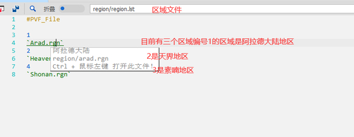
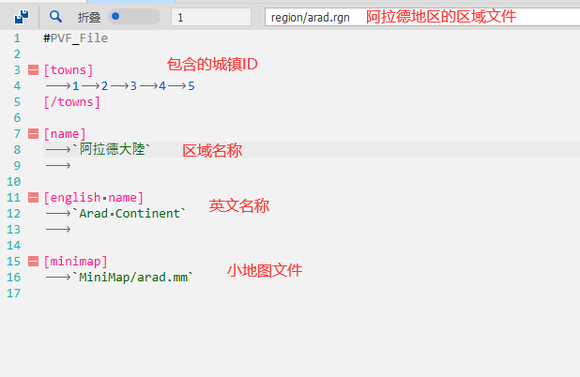
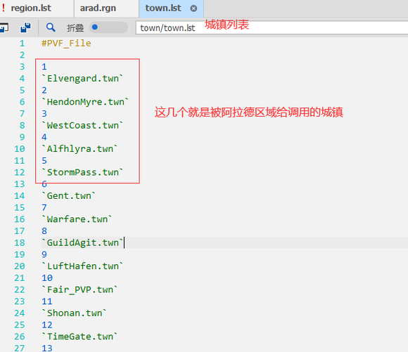
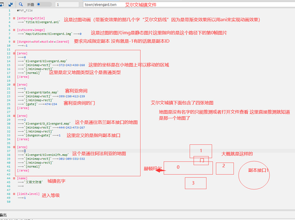
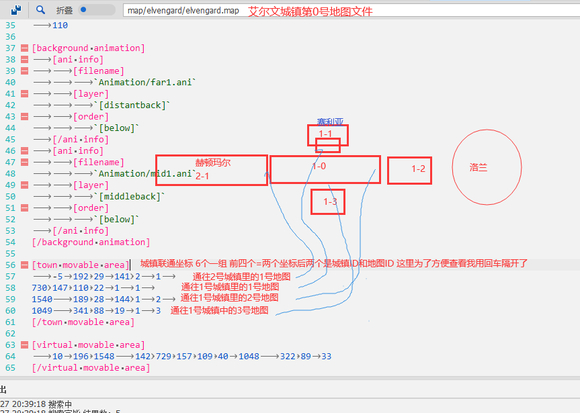
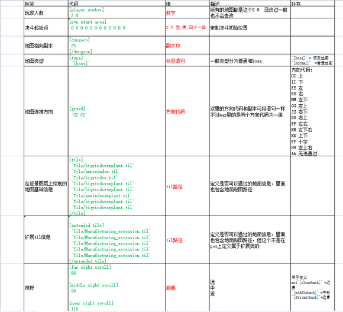
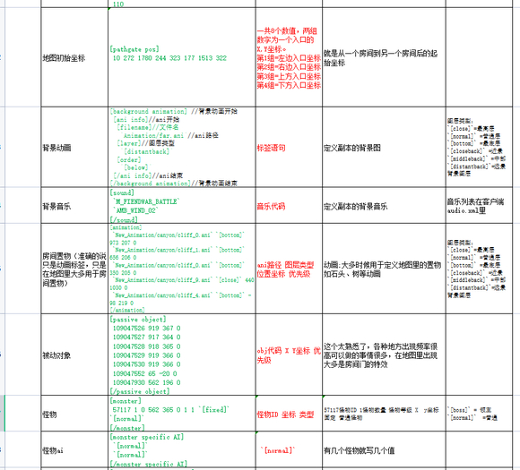
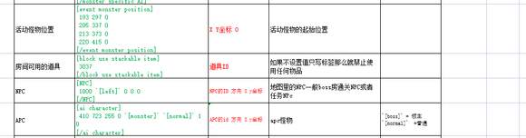

# 城镇修改

修改城镇前我们要明白城镇是由什么组成的，众所周知DNF是一个房间到另一个房间的游戏，城镇也是一样所以城镇的组成其实和副本的组成差别不大都是由一个个地图文件（.map）组成的
城镇涉及的主要文件：
.rgn区域（里面定义了区域里包含那些城镇和对应那一个.mm文件）
.twm（城镇文件 里面包含城镇地图列表等级名称等）
.map（地图文件 和副本地图文件差不多）
.mm(全称minimap意思为迷你地图，就是我们在游戏中按M键看到的地图)
众所周知大部分要在游戏里生效的文件都会有列表赋予它ID 用ID来表示它，例如我们的装备27564（魔剑）而为什么27564能代表魔剑文件就是装备列表文件给它赋予的ID （可以理解为代号 华安进华府用9527来表示它一个道理，主要是方便调用）
区域的列表region/region.lst
城镇的列表town/town.lst
城镇地图比较特殊没有单独的文件赋予它ID，它的列表直接是在城镇文件里赋予的
迷你地图列表：它没有直接被赋予ID而是直接在区域里写的文件路径






综上所诉要在pvf中表示通往洛兰副本的那个房间
区域=1
城镇=1
地图=2
1 1 2 （完整表示是1 1 2 一般情况下这个只用得到城镇地图和地图之间的连接 用1 2表示就可以了，跨区域一般是用NPC传送 ）


坐标：第一个是你出发的坐标 第二个是你到达的坐标
这就是城镇之间连接方式，当然还有其他几种方式例如传送门，NPC传送等
传送门的话只有起始坐标和到达坐标没有城镇ID和地图ID 用-2 -2 表示 传送门直接写在城镇文件里的地图列表下面
-1 -1 表示没有例如通向副本接口就用-1 -1 表示然后副本接口ID写在城镇文件里的地图列表下面

```ini
#PVF_File


[background pos]//背景位置 没用默认就行
80


[player number]//玩家编号 没用默认就行
2 8


[pvp start area]//pvp起始坐标 没用只有PK场的地图才有用 城镇地图这里有应该是街头争霸相关
668 207 558 240 669 206 62 243 1152 204 67 247


[pvp practice start area]//pvp练习坐标 没用只有PK场的地图才有用 城镇地图这里有应该是街头争霸相关
669 206 62 243 1152 204 67 247


[type]//类型 除了boss地图一般都是normal表示正常
`[normal]`


[tile]//til 这个是地面贴图文件
`Tile/ForestOver.til`
`Tile/ForestOver.til`
`Tile/ForestOver.til`
`Tile/ForestOver.til`
`Tile/ForestOver.til`
`Tile/ForestOver.til`
`Tile/ForestOver.til`
[/tile]


[far sight scroll]//远景
50


[middle sight scroll]//中景
90


[near sight scroll]//近景
110
这三个也是几乎所有的map文件都有，一般用于调用的ani层数定义
[background animation]//ani动画
[ani info]
[filename]
`Animation/far1.ani`//ani路径
[layer]
`[distantback]`//ani图层
[order]
`[below]`//最下层 相当于权重最下层肯定可以被上层的挡住
[/ani info]
[ani info]
[filename]
`Animation/mid1.ani`
[layer]
`[middleback]`
[order]
`[below]`
[/ani info]
[/background animation]


[town movable area]//城镇地图联通坐标
-5 192 29 141 2 1 730 147 110 22 1 1 1540 189 28 144 1 2 1049 341 88 19 1 3
[/town movable area]


[virtual movable area]//虚拟可移动区域四个一组 传送相关坐标？
10 196 1548 142 729 157 109 40 1048 322 89 33
[/virtual movable area]


[sound]//背景音乐 列表在客户端的audio.xml文件里查看
`M_FOREST_TOWN`
`AMB_FOREST_01`
[/sound]


[animation]//调用的ani：ani路径 权重 X轴 Y轴
`Animation/ElvenSgate.ani` `[normal]` 1094 359 0
`Animation/elvenlight1.ani` `[normal]` 1094 359 0
`Animation/elvenLtw.ani` `[normal]` 126 192 0
`Animation/elvenRdg.ani` `[normal]` 1443 192 0
`Animation/Flag0.ani` `[normal]` 495 177 0
`Animation/SeriaLight01.ani` `[bottom]` 775 166 0
`Animation/SeriaLight00.ani` `[bottom]` 775 166 0
`Animation/BlackSmith.ani` `[bottom]` 382 187 0
`Animation/Block1.ani` `[bottom]` 1235 278 0
`Animation/Block1.ani` `[bottom]` 563 278 0
`Animation/Block1.ani` `[bottom]` 339 278 0
`Animation/Block1.ani` `[bottom]` 115 278 0
`Animation/Block1.ani` `[bottom]` 787 278 0
`Animation/Block1.ani` `[bottom]` 1011 278 0
`Animation/Block1.ani` `[bottom]` 1459 279 0
`Animation/Tree1.ani` `[closeback]` 1240 184 0
`Animation/Gate.ani` `[closeback]` 776 52 0
`Animation/elvensign00.ani` `[closeback]` 1061 114 0
[/animation]


[passive object]//调用的obj：objID X轴 Y轴
5 150 150 0
6 330 230 500
5 650 190 0
6 830 270 500
5 1150 170 0
6 1330 250 500
[/passive object]


[NPC]//地图中NPC：npcID npc朝向左或右用单词表示 X轴 Y轴（副本地图里也会有npc一样的写法）
8 `[left]` 1370 173 0
1 `[left]` 445 186 0
[/NPC]


[map name]//地图名称 毛用没有
`PVP 無名`
```

补充一个副本地图的教程，原理都差不多





