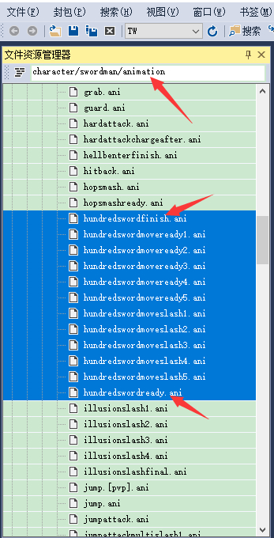
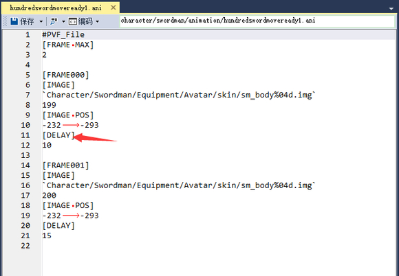
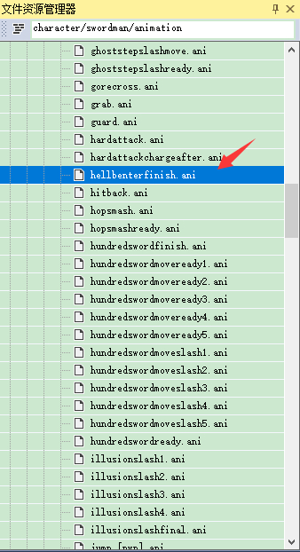
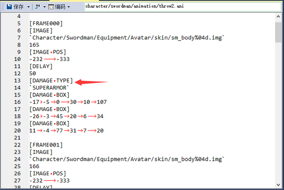

# 一些技能修改教程

## 剑魂觉醒斩击速度

剑魂觉醒释放之后人物会做出一系列动作，修改的思路便是找到这些动作文件并且修改这些文件来加快动作

> 人物释放技能时会做出相应的动作，说明必然调用了某些文件，.ani文件正是这些动作的文件。人物的英文是character


这些文件的位置在  箭头所指的两个文件中, 第一个文件为觉醒的最后一击时人物的动作，第二个文件为起始时人物的动作


以一个文件为例:

箭头所指的就是决定人物动作快慢的数据，修改这个数值就可以变化人物动作的快慢, 要想做到快速攻击就把这个数值改小就行了


## 狂战一觉脱手

狂战觉醒拍下去之后也有人物动作，让狂战拍完就起身的思路就是让狂战拍下去之后的动作的持续时间改为0




可以看到[DELAY]下面的一个数值，把这个数值改小狂战拍完后继续做的动作的持续时间就会缩短，楼主把这个数据改为了1，狂战基本上就能拍完起立。另外，这个文件里有多个delay下面的数值，如果不能确定哪几个是拍完后的动作的可以在npk文件内看，就是[IMAGE]下的路径


## 鬼泣放阵时进入霸体状态

实现这一效果的思路就是在鬼泣放阵的动作文件内加入霸体代码
鬼泣放阵时的动作和狂战放狂暴时的动作还有鬼剑扔爆弹等道具时的动作相同，所以这些动作应该是用的同一个动作文件


实际上这就是上面说的那些动作所用的动作文件

打开动作文件在其中加入霸体代码，这样在做这个动作时就会调用霸体状态


霸体代码为
```
[DAMAGE TYPE]
    `SUPERARMOR`
```

> [原贴](https://tieba.baidu.com/p/5588228348)


## 尼尔狙击高速狙击

关键在于 `data/skill/gunner.sd` 这个文件（应该是远古时代的技能数据文件，有些技能的数据定义在这里）
```yaml
`ns recoil time`    400
```
应该是狙击镜抖动时间，默认 0.4s，改小即可。当然还要配合静态数据的狙击冷却时间。

> 全身狙击绿气息很可能会把狙击冷却时间减到负数，导致只能打出一发（众所周知负数=无穷大doge），所以要么把静态数据调高，要么把绿气息减少狙击冷却时间的词条删掉。
