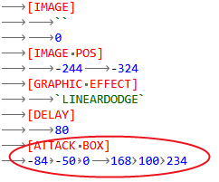
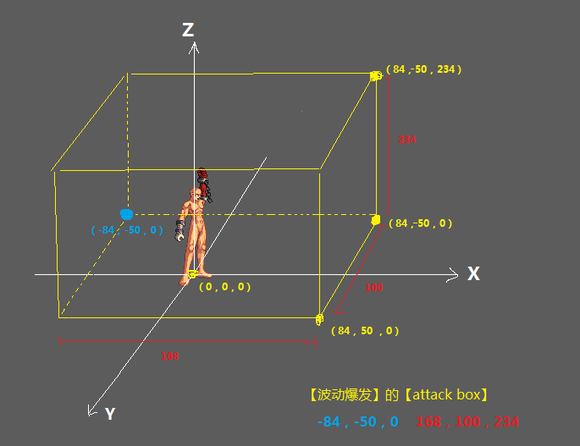

# 修改技能范围(没有静态数据控制)

众所周知，很多技能的范围都是由skl里对应的静态数据或等级成长数据控制，但是像阿修罗的【波动爆发】之类的，skl里没有对应数据的技能该怎么修改范围呢？答案很简单，在ani里修改~

首先我们先找到【波动爆发】的ani文件

可以看到里面很多帧动画，每一帧都有一个【attack box】标签，box其实很好理解，就当它是个长方体盒子，这个盒子标签下面有6个数据。
前3个数据表示的是这个长方体左下角的起点坐标（x，y，z），后3个数据表示的是这个长方体的长宽高~

看这张图是不是就很好理解了？蓝色字体对应的前3个数据表示这个长方体的起点，红色字体对应的后3个数据表示长宽高，以这个起点开始，画一个长方体，那么整个黄色的长方体就是【波动爆发】的攻击范围啦

所以当我们想增加【波动爆发】前面的攻击范围时，只需要将这个长方体的长度：168提高~

当我们想增加【波动爆发】身后的攻击范围时，需要将这个长方体的原点的X坐标：-84改小，同时还要等量提高长方体的长度哦~

比方说：假如你改成-134，也就是往身后移了50码，那么长方体的长度就要提高50码，因为起点的移动是带动整个长方体往身后移动的（对着上面的图脑补一下？），如果不提高长度，那么这个长方体的右下角坐标就会变成（34，-50，0），就会出现身前的攻击范围变小的情况~

> [原贴](https://tieba.baidu.com/p/7573870492)
