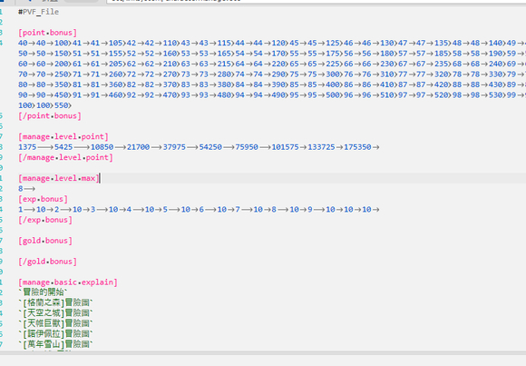

# 冒险团和支援兵

## 冒险团修改

冒险团文件路径etc/linksystem/charactermanage.etc

第一个：[point bonus]冒险团达到等级所获得的经验 默认是40 -100级
三个数字一组 40 40 100 等级 等级 经验值
代表40级到40级获得100点冒险团经验
如果要关闭冒险团 比如你的版本是60级那么就只需要留一个 61 61 100 把起始等级改为高于你版本的等级即可。
第二个：[manage level point]代表冒险团升级需要的经验值
[manage level point]
1375 5425 10850 21700 37975 54250 75950 101575 133725 175350
可以看到有10个 代表10个等级需要的经验值
第三个：[manage level max]
冒险团的最大等级上限 默认是8级
[manage option]冒险团每个等级对应的四维增加量
112131415161718191101
以上代表 1级1点 2级1点 3级1点...两个一组 冒险团等级 四维增加量

## 关闭支援兵
支援兵路径：etc/linksystem/characlinksystem.etc
要关闭支援兵直接改第一个词条
[link level]改为超过你版本等级即可，例如60级你改为61级

菜单界面删除支援兵；当PVF限制了支援兵等级后，可以去菜单界面删除对应的NPK实现 版本内完全无冒险团

删除帧内图像 第22、23、24、25帧，记住不要删除帧只清除图像即可。

## 支援兵技能修改
文件路径：etc/linksystem/striker.etc
找到标签[striker skill]
很好理解 【0是角色编号】 【 3是职业编号】【 24就是技能编号】【1是视频编号】，【0是前置技能】，是后面的路径结尾是avi这是视频格式文件，所以是技能视频。
那么第一条的意思就是0号角色 3号职业的第24号技能 1号视频 不需要前置技能 技能视频路径。

