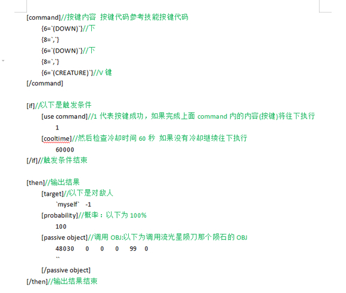

# 装备按键触发技能（进阶教程）

这个需要一定PVF修改基础，看懂了也简单有手就行。我尽量通俗易懂点
比如我想做一个装备 特效是按↓↓+V键触发[流星雨]技能，冷却时间60秒。
那么我要实现的操作：
触发条件就是按↓↓+V键
输出结果一个obj，
以下是代码详解：

由此可见起始和流光星陨到没什么区别 只是触发条件从攻击成功变成按键成功，举一反三可以利用这个方法实现很多种调用obj的装备，例如很多怪物的技能就是obj我们一样的也可以直接调用怪物的技能，技能伤害可以在obj里的攻击内容修改。

害怕修改伤害怪物也变强那就复制一份怪物的obj，文件重命名，重新在obj列表里给它赋予一个ID，记住攻击文件也要复制一份

我自己研究出来很多的PVF修改方法 以及技巧，不知道该分享那些，奈何才疏学浅，
这个是几年前尝试的以宠物为灵感，因为宠物它也是装备类，宠物蛋=装备 宠物=装备 宠物外观才是宠物文件。
教程里的一些其他操作都是根据理论来推测的，一个人的灵感和精力是有限的，希望这个教程能打开你们的想法。
