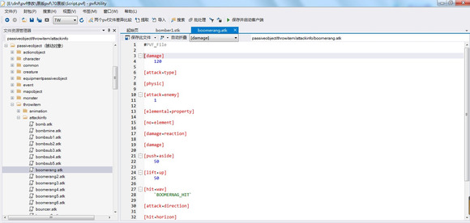

# 投掷物伤害

消耗品位置 stackable/throw/
唯一需要注意的点是
[cool time]
3000
投掷之后物品的冷却时间

伤害文件位置passiveobject/throwitem/attackinfo/

常用的五个投掷物品对应的名字
boomesub 爆弹
boomerang 回旋镖
bouncer 飞盘
grave 石头
suriken 飞镖
其他的自己对应就好 按照次序1.2.3.4.5与消耗品中的1.2.3.4.5相对应

[absolute damage] 绝对伤害
100

[damage bonus] 伤害加成 这一项可能有的pvf 没有
0

伤害计算： 最终伤害=绝对伤害*（1+伤害加成/100）
也就是说
[absolute damage]
200

[damage bonus]
0
与
[absolute damage]
100

[damage bonus]
100

最终伤害都是一样的（理论上），这里还是想请教一下大佬 这两个计算在实际应用中有什么差别
[push aside] 击退距离
50

[lift up] 浮空距离
10
我更改了发现差距不大，可能是数据调整有些问题
[no blood] 不造成出血
1501.0
[blood] 造成出血
1501.0