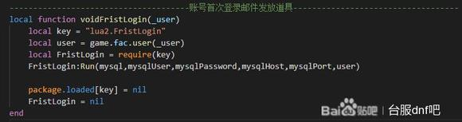
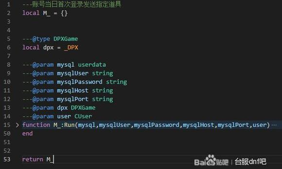
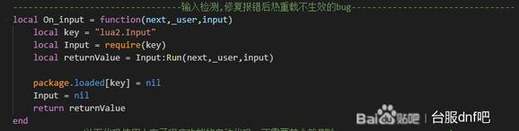
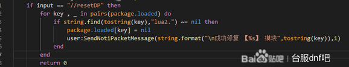

# dp插件热重载

这玩意对于那些不要求返回值的hook都可以照搬来用,要求返回值的稍微麻烦一丢丢。
你得把函数赋值给一个变量，销毁require的包以后再把那个变量返回。

另外热重载的文件如果运行报错的话会失效,因为没有正常销毁require的包就被强制中止了。
下次运行的话因为已经require了这个包又不会重新require。
所以添加一个修复出错后热重载失效的小功能。

运行报错以后只要在聊天框里输入 "//resetDP"就可以手动销毁掉之前报错的包,然后继续调试就可以了。

